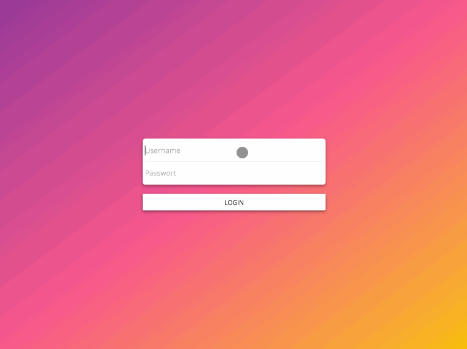
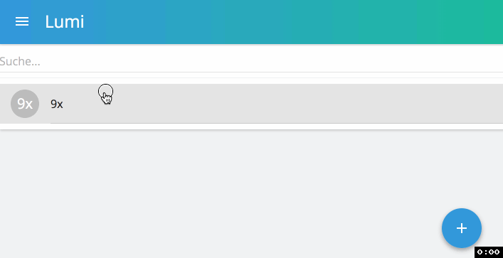
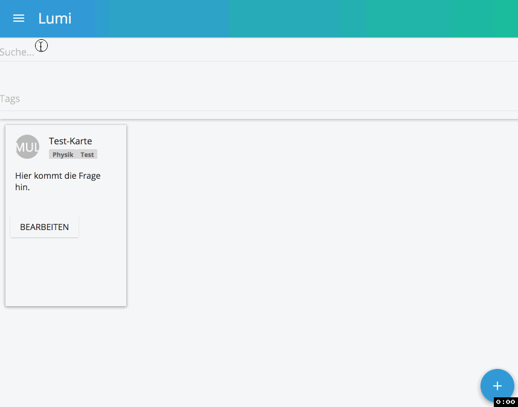
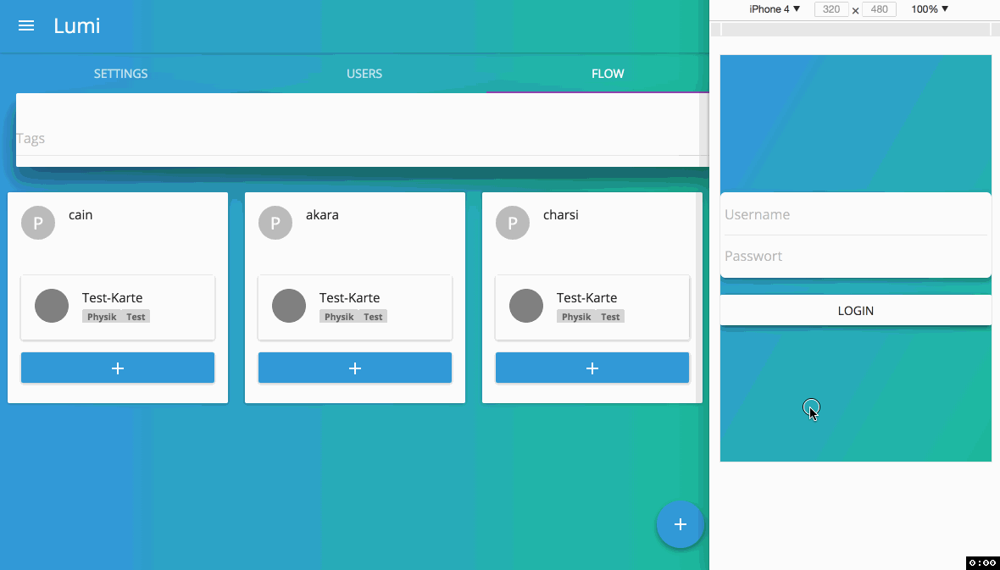

# Erste Schritte

Hier erfährst du wie du Lumi für den Einsatz im Klassenzimmer vorbereitest. Im Beispiel werden wir für die Klasse 9x, die aus 5 Lernern besteht, Material für das Fach Physik bereitstellen.

Lumi macht viele Dinge anders. Bevor du mit den ersten Schritten beginnst, empfehlen wir dir, dich mit dem [Konzept](/lumi/CONECPT.md) und der [Terminologie](/lumi/TERMINOLOGY.md) vertraut zu machen.

## WLAN

Du erreichst Lumi nach dem Neustarten des Raspberry Pis über das WLAN mit dem Namen "Lumi X". Das Passwort ist standardmäßig "lumilumi". Einstell-Optionen folgen in späteren Versionen.

-   WLAN: Lumi X
-   Passwort: lumilumi

## Adresse

Lumi ist als Webseite programmiert und mit jedem Browser aufrufbar. Im optimalen Fall sollte Lumi über http://Lumi erreichbar sein. Da dies aber noch nicht zuverlässig klappt ist Lumi auch über seine IP-Adresse erreichbar: http://10.0.0.1

-   URL: http://10.0.0.1 oder http://Lumi

## Login

Lumi installiert automatisch einen Admin-Account. Um diesen zu erreichen einfach mit dem Benutzernamen "admin" ohne Passwort anmelden. Im nächsten Schritt wird das Passwort gesetzt.

## Erstellen einer Gruppe

In diesem Fall wollen wir für die Klasse 9x eine Gruppe anlegen:

1. Menü öffnen. (Oben links)
2. Auf "Gruppen" klicken.
3. Auf das "+" unten rechts klicken.
4. Namen der Gruppe eingeben.
5. Auf "Create" klicken.

## Erstellen von Benutzern

Wir wollen nun 5 Benutzer-Accounts für unsere 5 Lerner anlegen. Es gibt zwei Möglichkeiten Benutzer anzulegen. - Wir besprechen hier erst einmal nur eine Methode:

1. Auf die eben erstelle Gruppe "9x" klicken.
2. Auf das "+" unten rechts klicken.
3. Namen des Benutzers eingeben. - Benutzernamen sollten nur einmal vergeben werden. Ist der Benutzer schon vorhanden, so wird er der Gruppe hinzugefügt. Alle so angelegten Benutzer sind automatisch der Gruppe 9x zugeordnet.

## Material erstellen

Wir wollen nun eine Multiplechoice-Karte erstellen.

1. Menü öffnen.
2. Auf "Material" klicken.
3. Auf das "+" unten rechts klicken.
4. Name der Karte eintragen.
5. Typ (in diesem Fall Multiplechoice) wählen.
6. Unter Text wird die Fragestellung eingetragen. Die Karten unterstützen [Markdown].(https://github.com/adam-p/markdown-here/wiki/Markdown-Cheatsheet)
7. Unter Items werden die Antwortmöglichkeiten eingetragen. Eine richtige Antwort beginnt mit einem kleinen x (Beispiel: "x Diese Antwort ist richtig"). Falsche Antworten beginnen mit einem kleinen o. Alle Antworten werden durch ein "Enter" getrennt.
8. (Optional) Karte mit Tags versehen.

## Material zuweisen

Das Material soll nun allen Lernern der Klasse 9x als Aufgabe zugewiesen werden.

1. Menü öffnen
2. Auf "Gruppen" klicken.
3. Auf die gewünschte Gruppe klicken. (In diesem Fall 9x)
4. Im Reiter auf "Flow" klicken.
5. Auf as "+" unten rechts klicken.
6. Material durch hinzufügen auswählen.
7. Auf "Zuweisen" klicken.

Allen Lernern der Klasse 9x wurde nun das Material als Aufgabe zugewiesen.
Die Lernen können sich nun anmelden und die Aufgabe bearbeiten.

## Benutzer Anmeldung und Bearbeiten der Aufgaben

Lerner melden sich genau so an, wie der Admin bei der ersten Anmeldung. Der Lerner muss seinen Benutzernamen eingeben und anschließend ein Passwort auswählen.
Nach der Anmeldung sieht der Lerner eine Liste mit seinen Aufgaben.

Hier ist ein "Split-Screen": Links ist das Admin-Interface in der Gruppen-Flow Ansicht. Rechts ist die Ansicht des Lerners. Sobald der Lerner eine Aufgabe bearbeitet hat erscheint diese im Admin-Interface gelb hinterlegt. Wird die Aufgabe automatisch ausgewertet, so erscheint die prozentuale Auswertung im Admin-Interface.

### Tipps für den Einsatz im Unterricht

Lumi hat bis jetzt auf über 120 Smartphones funktioniert. Eine typische Aussage von Schülern beim ersten Benutzen von Lumi ist allerdings: "Bei mir funktioniert das nicht."
Hier ein paar Tipps um Lumi zum Laufen zu bekommen:

1. Mit dem WLAN verbunden? - Lumi funktioniert nur, wenn das Handy im Lumi X-WLAN ist.
2. Adresse richtig eingegeben? - Schüler geben gerne folgende Sachen ein: http.//10.0.0.1 oder https://10.0.0.1 Es ist wichtig, dass die Adresse genau http://10.0.0.1 geschrieben ist.
3. Anderen Browser ausprobieren. Mit Google Chrome oder der Google App hat Lumi jedes mal funktioniert.
4. Incognito-Modus deaktivieren.
